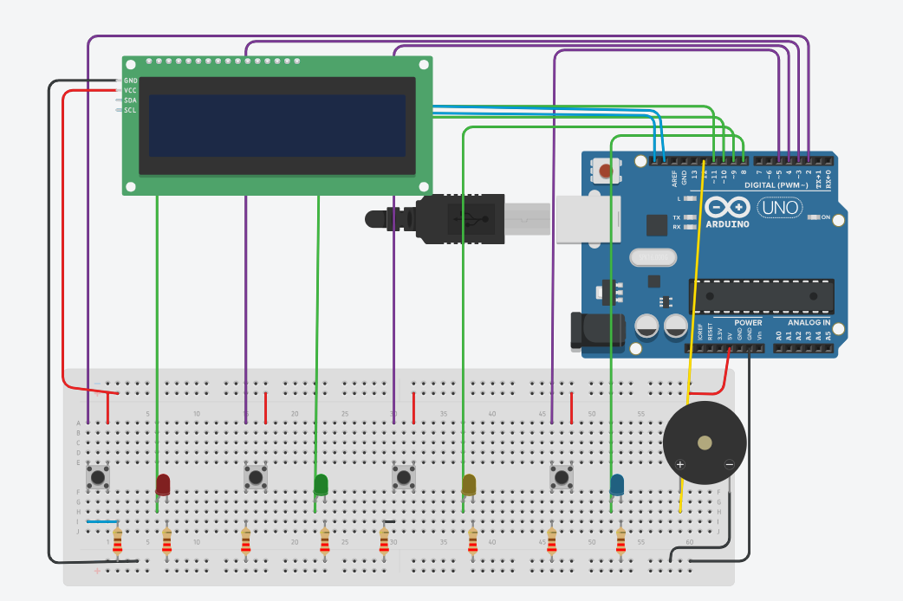

# 🎮 Simon Says Game (Arduino UNO)

This project is a **Simon Says memory game** built using an **Arduino UNO**, push buttons, LEDs, a buzzer, and a 16x2 LCD display (I²C). The game challenges the player to repeat an increasingly complex sequence of lights and sounds.

---

## 🔧 Components Used
(Full list is in `components list.csv`)

- Arduino UNO  
- 4 LEDs (Red, Green, Yellow, Blue)  
- 4 Push Buttons  
- Resistors (220Ω)  
- Buzzer  
- 16x2 LCD Display with I²C module  
- Breadboard & Jumper wires  

---

## ⚡ Features
- LCD displays game status and score.  
- Randomly generated sequences increase in length with each round.  
- Buzzer provides feedback (correct/wrong input).  
- Game over message when a wrong button is pressed.  

---

## 📜 How It Works
1. Game generates a random sequence of LED blinks.  
2. Player must press the corresponding buttons in order.  
3. If the sequence is correct, the game progresses to the next round with a longer sequence.  
4. If the player makes a mistake, the game ends.  

---

## 📂 Repository Structure
```
📦 simon-says-game
├── components list.csv      # List of hardware components
├── simon says game.pdf      # Circuit schematic
├── simon_says_game1.png     # Circuit diagram (image)
├── src/
│   └── simon_says_game.ino  # Arduino source code
└── README.md                # Documentation
```

---

## 🔌 Circuit Diagram


---

## 🚀 Getting Started

### 1️⃣ Upload the Code
- Open `simon_says_game.ino` in Arduino IDE.  
- Select **Arduino UNO** as board.  
- Upload the code to your Arduino.

### 2️⃣ Build the Circuit
- Follow the schematic (`simon says game.pdf`) or the image (`simon_says_game1.png`).  

### 3️⃣ Play
- Watch the sequence of LEDs.  
- Repeat the sequence using the buttons.  
- Try to beat your high score!  

---

## 📄 License
This project is open-source. Feel free to use, modify, and share.  

---
---

## 🙏 Acknowledgements
This project is heavily inspired by an open-source Simon Says game project on GitHub.  
Most of the code and circuit design were adapted from an unknown author’s repository.  
Full credit goes to the original creator — if you are the author, please reach out so we can properly acknowledge you here.

## 🤝 Contributions
Pull requests and improvements are welcome!  
